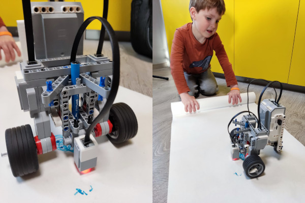
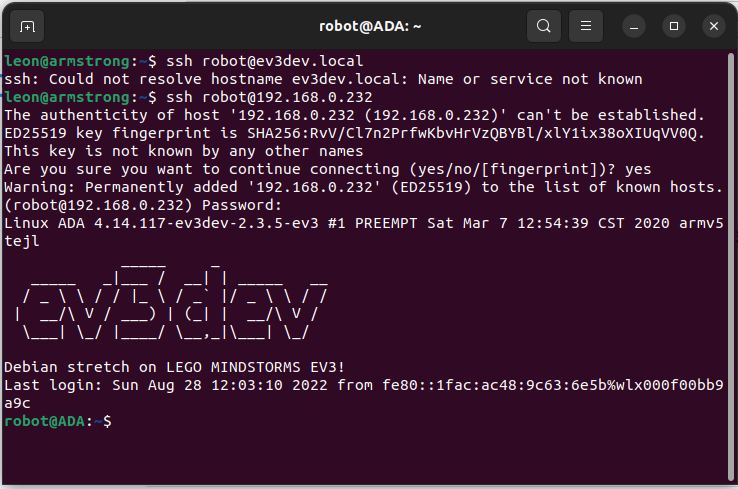
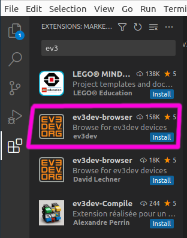
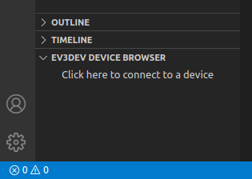
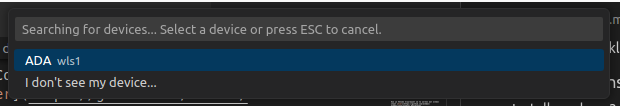
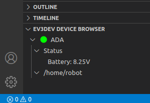
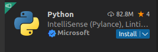
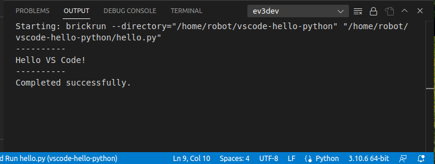
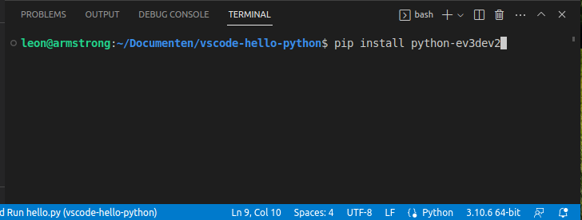
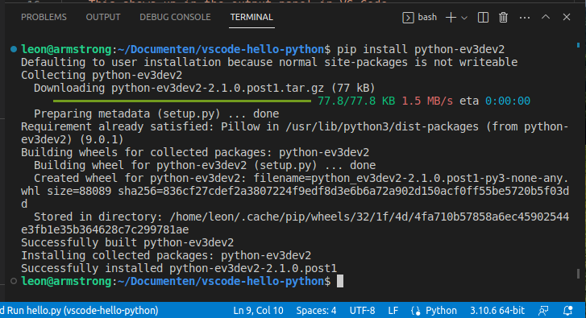

# Python met de EV3 Lego Robot

Tekenen met een Lego EV3 MindStorms Robot.



## Installeer Python

Ja echt, je kan best Python installeren op je computer als je wil programmeren in Python. Je kan programmeren zonder maar dan kan je je code niet uitvoeren en dat is toch net wat minder leuk.

## Verbinden met de robot

Als de robot verbonden is met hetzelfde wifi-netwerk als je computer kan je verbinden met ssh:

```shell
ssh robot@192.168.0.232
```

Het juiste ip-adres kan je aflezen op het scherm van de robot.

> Het wachtwoord voor de gebruiker **robot** is **maker**.



## Visual Studio Code

Hoe je VSCode klaarmaakt om te werken met ev3dev staat [hier](https://github.com/ev3dev/ev3dev-lang-python) beschreven.

### VSCode Extension

Installeer de ev3dev-browser extensie voor Visual Studio Code:



Na de installatie komt er een **EV3DEV DEVICE BROWSER** optie links onderaan in VSCode.



Als je op **Click here to connect a device** klikt krijg je bovenaan een drop down waar je je robot kan selecteren. Mijn robot heet **ADA** dus ik klik daar op.



De robot verschijnt in de Device Browser.



> Meer mogelijkheden van de Device Browser vind je op de [GitHubpagina](https://github.com/ev3dev/vscode-ev3dev-browser).

### Voorbeeldproject

We volgen [dit](https://github.com/ev3dev/vscode-hello-python) voorbeeld. Als dat goed gaat weten we dat onze omgeving goed is opgezet en zijn we klaar voor het echte werk.

> Van de voorgestelde plugins hebben we ev3dev-browser al maar je kan ook nog de *Python extension for Visual Studio Code* installeren:



Als je de stappen in het voorbeeldproject goed hebt gevolgd staat het script `hello.py` op de robot en zie je in de console van VSCode de boodschap **Hello VS Code!** verschijnen.



### Code Completion

Om code completion te laten werken in VSCode moet je de Python packagep `python-ev3dev2` installeren. Dit kan je doen in een virtuele omgeving maar ik doe het nu system wide, typ in een terminalvenster:

```shell
pip install python-ev3dev2
```





## De robot laten rijden

De *getting started* gids voor Python met Lego EV3 vind je [hier](https://github.com/ev3dev/ev3dev-lang-python).

We richten onze aandacht nu op het aansturen van de twee motoren op poorten B en C. Om deze te kunnen bedienen met Pythoncode moeten we `LargeMotor` importeren in ons script. 

De functie `SpeedPercent` laat ons toe de snelheid van de motor te specifiëren als een percentage van de maximumsnelheid. `SpeedPercent(100)` is de maximumsnelheid, `SpeedPercent(50)` is de helft daarvan.

### Een enkele motor

```Python
from ev3dev2.motor import OUTPUT_B
from ev3dev2.motor import LargeMotor, SpeedPercent

motor_links = LargeMotor(OUTPUT_B)
motor_links.on_for_rotations(SpeedPercent(75), 5) #5 rotaties aan 75% snelheid
```

### Twee motors

Je hebt misschien gemerkt dat je met de vorige manier geen twee motoren tegelijk kan laten werken. Hiervoor gebruiken we de class `MoveTank`. Experimenteer ook eens met `on_for_rotations`, `on_for_seconds` en `on_for_degrees`.

```Python
from ev3dev2.motor import OUTPUT_B, OUTPUT_C
from ev3dev2.motor import LargeMotor, MoveTank, SpeedPercent

tank_drive = MoveTank(OUTPUT_B, OUTPUT_C)

# laat de robot ter plaatse draaien
# door de motors in tegengestelde richting te laten draaien
tank_drive.on_for_seconds(SpeedPercent(50), SpeedPercent(-50), 3)
```

## De robot laten tekenen

Nu je weet hoe je de robot kan laten bewegen kan je hem ook laten tekenen. Steek er een stift in en zet hem op een blad papier.

Maak in je code gebruik van `loops` en `functies`.

Een functie gebruik je om een stukje code dat bij elkaar hoort netjes onder te brengen en een naam te geven. Die functie kan je dan gebruiken in je code, hierdoor wordt je code leesbaarder. Je kan functies ook andere functies laten aanroepen, zo structureer je je code en blijft deze overzichtelijk en herbruikbaar.

In Python maak je een functie door het keyword `def` te gebruiken:

```Python
from ev3dev2.motor import OUTPUT_B, OUTPUT_C
from ev3dev2.motor import LargeMotor, MoveTank, SpeedPercent

tank_drive = MoveTank(OUTPUT_B, OUTPUT_C)

def draai_links():
    tank_drive.on_for_degrees(SpeedPercent(50), SpeedPercent(-50), 233.5)

def rijd_10_cm():
    tank_drive.on_for_degrees(SpeedPercent(50), SpeedPercent(50), 360)

def teken_vierkant():
    for i in range(4):
        rijd_10_cm()
        draai_links()

teken_vierkant()
```